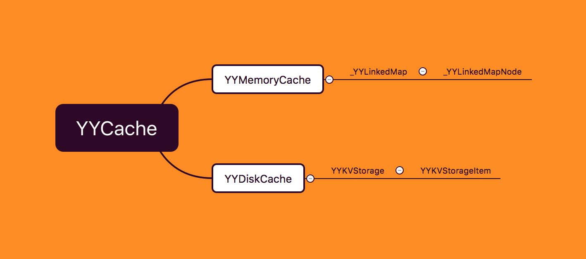
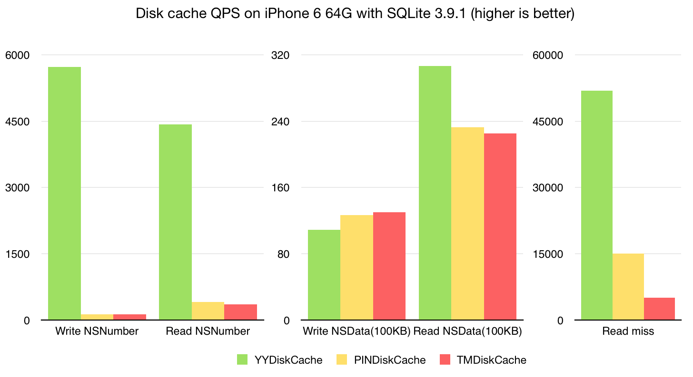

# YYCache

整个YYCache的结构是 既有通过缓存进行高速存取的YYMemoryCache 也有针对本地的缓速持久化保存的YYDiskCache 所以可以看完YYCache再将其细分成这两个部分来观看 不过先看看YYCache的属性和方法 （图从别的博客盗用一下）

* [YYMemoryCache](./YYMemoryCache)
* [YYDiskCache](./YYDiskCache)

## YYCache的头文件

```objective-c
@interface YYCache : NSObject

@property (copy, readonly) NSString *name;
@property (strong, readonly) YYMemoryCache *memoryCache;
@property (strong, readonly) YYDiskCache *diskCache;


- (nullable instancetype)initWithName:(NSString *)name;
- (nullable instancetype)initWithPath:(NSString *)path NS_DESIGNATED_INITIALIZER;
+ (nullable instancetype)cacheWithName:(NSString *)name;
+ (nullable instancetype)cacheWithPath:(NSString *)path;

- (instancetype)init UNAVAILABLE_ATTRIBUTE;
+ (instancetype)new UNAVAILABLE_ATTRIBUTE;

#pragma mark - Access Methods
- (BOOL)containsObjectForKey:(NSString *)key;
- (void)containsObjectForKey:(NSString *)key withBlock:(nullable void(^)(NSString *key, BOOL contains))block;

- (nullable id<NSCoding>)objectForKey:(NSString *)key;
- (void)objectForKey:(NSString *)key withBlock:(nullable void(^)(NSString *key, id<NSCoding> object))block;

- (void)setObject:(nullable id<NSCoding>)object forKey:(NSString *)key;
- (void)setObject:(nullable id<NSCoding>)object forKey:(NSString *)key withBlock:(nullable void(^)(void))block;

- (void)removeObjectForKey:(NSString *)key;
- (void)removeObjectForKey:(NSString *)key withBlock:(nullable void(^)(NSString *key))block;
- (void)removeAllObjects;
- (void)removeAllObjectsWithBlock:(void(^)(void))block;
- (void)removeAllObjectsWithProgressBlock:(nullable void(^)(int removedCount, int totalCount))progress
                                 endBlock:(nullable void(^)(BOOL error))end;

@end
```

整个的方法声明基本上跟NSCache的很像 这里也可以看到YYCache的实例是有强引用C和YYDiskCache的实例的 所以创建或者操作YYCache的实例的同时也会创建或者操作这两个类的实例 拥有它们所提供的功能

## YYCache的实现文件

```objective-c
- (instancetype) init {
    NSLog(@"Use \"initWithName\" or \"initWithPath\" to create YYCache instance.");
    return [self initWithPath:@""];
}

- (instancetype)initWithName:(NSString *)name {
    if (name.length == 0) return nil;
    NSString *cacheFolder = [NSSearchPathForDirectoriesInDomains(NSCachesDirectory, NSUserDomainMask, YES) firstObject];
    NSString *path = [cacheFolder stringByAppendingPathComponent:name];
    return [self initWithPath:path];
}

- (instancetype)initWithPath:(NSString *)path {
    if (path.length == 0) return nil;
    //会根据路径path传给YYDiskCache去创建其实例 创建YYMemoryCache实例
    //并将其强引用
    YYDiskCache *diskCache = [[YYDiskCache alloc] initWithPath:path];
    if (!diskCache) return nil;
    NSString *name = [path lastPathComponent];
    YYMemoryCache *memoryCache = [YYMemoryCache new];
    memoryCache.name = name;
    
    self = [super init];
    _name = name;
    _diskCache = diskCache;
    _memoryCache = memoryCache;
    return self;
}

+ (instancetype)cacheWithName:(NSString *)name {
    return [[self alloc] initWithName:name];
}

+ (instancetype)cacheWithPath:(NSString *)path {
    return [[self alloc] initWithPath:path];
}

- (BOOL)containsObjectForKey:(NSString *)key {
    return [_memoryCache containsObjectForKey:key] || [_diskCache containsObjectForKey:key];
}

- (void)containsObjectForKey:(NSString *)key withBlock:(void (^)(NSString *key, BOOL contains))block {
    if (!block) return;
    
    if ([_memoryCache containsObjectForKey:key]) {
        dispatch_async(dispatch_get_global_queue(DISPATCH_QUEUE_PRIORITY_DEFAULT, 0), ^{
            block(key, YES);
        });
    } else  {
        [_diskCache containsObjectForKey:key withBlock:block];
    }
}

- (id<NSCoding>)objectForKey:(NSString *)key {
    id<NSCoding> object = [_memoryCache objectForKey:key];
    if (!object) {
        object = [_diskCache objectForKey:key];
        if (object) {
            [_memoryCache setObject:object forKey:key];
        }
    }
    return object;
}

- (void)objectForKey:(NSString *)key withBlock:(void (^)(NSString *key, id<NSCoding> object))block {
    if (!block) return;
    id<NSCoding> object = [_memoryCache objectForKey:key];
    if (object) {
        dispatch_async(dispatch_get_global_queue(DISPATCH_QUEUE_PRIORITY_DEFAULT, 0), ^{
            block(key, object);
        });
    } else {
        [_diskCache objectForKey:key withBlock:^(NSString *key, id<NSCoding> object) {
            if (object && ![_memoryCache objectForKey:key]) {
                [_memoryCache setObject:object forKey:key];
            }
            block(key, object);
        }];
    }
}

- (void)setObject:(id<NSCoding>)object forKey:(NSString *)key {
    [_memoryCache setObject:object forKey:key];
    [_diskCache setObject:object forKey:key];
}

- (void)setObject:(id<NSCoding>)object forKey:(NSString *)key withBlock:(void (^)(void))block {
    [_memoryCache setObject:object forKey:key];
    [_diskCache setObject:object forKey:key withBlock:block];
}

- (void)removeObjectForKey:(NSString *)key {
    [_memoryCache removeObjectForKey:key];
    [_diskCache removeObjectForKey:key];
}

- (void)removeObjectForKey:(NSString *)key withBlock:(void (^)(NSString *key))block {
    [_memoryCache removeObjectForKey:key];
    [_diskCache removeObjectForKey:key withBlock:block];
}

- (void)removeAllObjects {
    [_memoryCache removeAllObjects];
    [_diskCache removeAllObjects];
}

- (void)removeAllObjectsWithBlock:(void(^)(void))block {
    [_memoryCache removeAllObjects];
    [_diskCache removeAllObjectsWithBlock:block];
}

- (void)removeAllObjectsWithProgressBlock:(void(^)(int removedCount, int totalCount))progress
                                 endBlock:(void(^)(BOOL error))end {
    [_memoryCache removeAllObjects];
    [_diskCache removeAllObjectsWithProgressBlock:progress endBlock:end];
    
}

- (NSString *)description {
    if (_name) return [NSString stringWithFormat:@"<%@: %p> (%@)", self.class, self, _name];
    else return [NSString stringWithFormat:@"<%@: %p>", self.class, self];
}

@end
```

在这些方法里面都可以看到针对YYCache实例所调用的方法的实现 都是同时对YYMemoryCache和YYDiskCache的实例做操作的

## 性能

虽然还没分析YYMemoryCache和YYDiskCache前就说性能感觉有点早 可是想了想好像没理由在别的地方写 所以先在这里写剧透一下吧

YYMemoryCache是用了双向链表来对每个节点执行LRU的缓存淘汰策略

count、age、cost三个维度来判断缓存的清理

使用更加底层的CFMutableDictionary对每个节点进行强引用

为了提高性能使用在多线程对链表进行操作的时候的pthread_mutex_t线程锁 并保证线程安全

还有对节点的引用解除是另外创建一条low优先度的队列去让其解除引用

 YYDiskCache是用了根据阙值20kb判断文件数据是否保存在sqlite3里 或者保存图片的元信息 然后通过数据库获取到的md5文件名再去文件路径里寻找图片

根据count、age、cost三个维度去判断文件的清理

还会根据LRU淘汰针对每个文件的上次access去淘汰少用的文件

根据路径对YYDiskCache实例进行全局的保存 减少过多的实例创建对资源的浪费

使用并发队列对执行YYDiskCache实例增删改查处理

使用wal模式提高数据库的读写速度

使用信号量作为锁

为啥会用信号量做锁 作者ibireme如下所说 而且另一个博客也说 相比pthread_mutex dispatch_semaphore对于阻塞的线程操作具有顺序性

> dispatch_semaphore 是信号量，但当信号总量设为 1 时也可以当作锁来。在没有等待情况出现时，它的性能比 pthread_mutex 还要高，但一旦有等待情况出现时，性能就会下降许多。相对于 OSSpinLock 来说，它的优势在于等待时不会消耗 CPU 资源。对磁盘缓存来说，它比较合适。

比较直观的对比是 假如用SDWebImage的缓存处理 是用NSCache做的 当图片多的时候会导致内存上升很高 可是YYWebImage在同样的图片量下不会出现这样的问题 

假如用数据来展示 就需要借用ibireme作者下的图片啦～



### 文章参考

[从YYCache源码Get到如何设计一个优秀的缓存](https://lision.me/yycache/)

[YYCache源码解析](https://knightsj.github.io/2018/01/23/YYCache%20源码解析/)

[YYCache 设计思路](https://blog.ibireme.com/2015/10/26/yycache/)