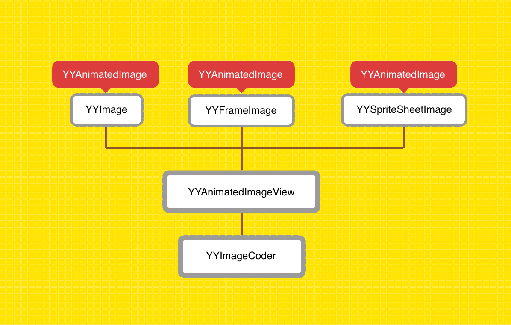

# YYWebImage

YYWebImage的结构如下（图是盗用一下～）

针对从UIImageView 调用seturl方法的实现内部可以看我写的注释就大概明白的

而且我在SDWebImage上写的很清楚 相对YY的处理也是异曲同工

1. 先找缓存里是否有
2. 若无 通过NSOperation先去本地磁盘寻找是否有该文件
3. 若无 再通过调用url去请求图片数据 获取完成的图片数据后再存在缓存和本地磁盘里

所以我打算将Image的部分分成三个部分

* [YYImageCoder](./YYImageCoder)
* [YYWebImageOperation](./YYWebImageOperation)
* [YYAnimatedImageView](./YYAnimatedImageView)

为什么会将其分成这三个部分 而不是按照图片的结构去划分呢 我觉得三个类YYImage YYFrameImage YYSpriteSheetImage可以直接看其源码就能明白其作用

然后整个框架来说我认为最屌就是这个YYImageCoder 跟SDWebImage的动态图片解码处理不一样 更加优化

其次YYWebImageOperation就是通过整个图片寻找逻辑的中心 比较值得看

最后就是YYAnimationImageVIew 之前说过播放大量动态图导致cpu暴涨的bug 看完之后不仅发现bug的所在 而且觉得它这样的设计其实挺特别的 所以我基于上面几点将Image方面从这里看了

## 性能

性能方面的话 使用了在解码图片时候 使用苹果推荐的参数 而SDWebImage的图片的解码都是当没有alpha通道做处理

> You use this function to configure the drawing environment for rendering into a bitmap. The format for the bitmap is a ARGB 32-bit integer pixel format using host-byte order. If the opaque parameter is YES, the alpha channel is ignored and the bitmap is treated as fully opaque (kCGImageAlphaNoneSkipFirst | kCGBitmapByteOrder32Host). Otherwise, each pixel uses a premultipled ARGB format (kCGImageAlphaPremultipliedFirst | kCGBitmapByteOrder32Host).

其次 对于动态图针对DISPOSE_METHOD 而做出的动态图解码实现 相比SDWebImage的处理更为优化 

可以看这篇[文章](http://www.leichunfeng.com/blog/2017/02/20/talking-about-the-decompression-of-the-image-in-ios/) 文章作者做出了框架之间的性能对比 我这边就不把它照搬啦

### 文章参考

[谈谈iOS中图片的解压缩](http://www.leichunfeng.com/blog/2017/02/20/talking-about-the-decompression-of-the-image-in-ios/)

[移动端图片格式调研](https://blog.ibireme.com/2015/11/02/mobile_image_benchmark/)

[iOS处理图片的一些小tip](https://blog.ibireme.com/2015/11/02/ios_image_tips/)

[iOS平台图片编解码入门教程](http://dreampiggy.com/2017/10/30/iOS平台图片编解码入门教程（Image:IO篇）/)

[iOS平台图片编解码入门教程(第三方编解码篇)](http://dreampiggy.com/2017/10/30/iOS平台图片编解码入门教程（第三方编解码篇）/)

[iOS平台图片编解码入门教程(vImage篇)](http://dreampiggy.com/2017/11/12/iOS平台图片编解码入门教程（vImage篇）/)